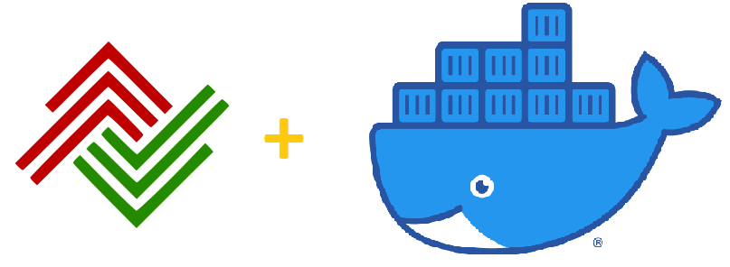

# Docker container for BTDEX


[](https://btdex.trade/)

This is a Docker container for [BTDEX](https://btdex.trade/).

The GUI of the application is accessed through a modern web browser (no installation or configuration needed on the client side) or via any VNC client.

---

## Quick Start

**NOTE**: The Docker command provided in this quick start is given as an example
and parameters should be adjusted to your need.

Launch the **BTDEX** docker container with the following command:
```
docker run -d \
  --name=container-btdex 
  -v ${pwd}/.config:/opt/btdex/.config \
  -v ${pwd}/plots:/opt/btdex/plots \
  -v ${pwd}/cache:/opt/btdex/cache \
  -p 5800:5800 \
  -p 5900:5900 \
  furritos/docker-btdex
```

Finally, take your favorite web browse and open `http://localhost:5800` 
Please refer to this [Get Started](https://btdex.trade/index.html#GetStarted) page for more information on using **BTDEX**.  

## Documentation

Full documentation is available at https://github.com/furritos/docker-btdex.

## Support or Contact

Having troubles with the container or have questions?  Please
[create a new issue].

[create a new issue]: https://github.com/furritos/docker-btdex/issues