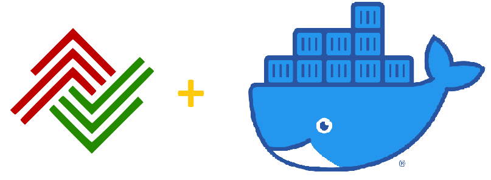
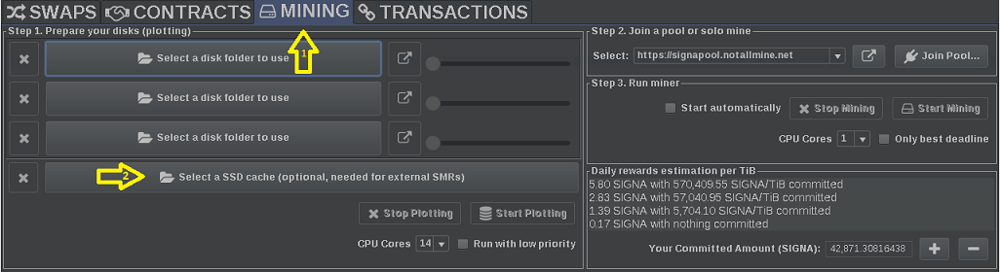
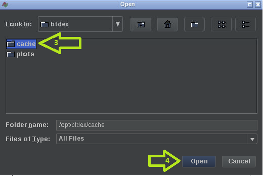
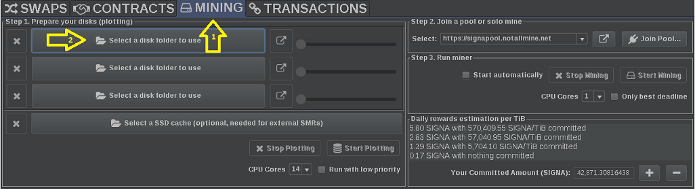
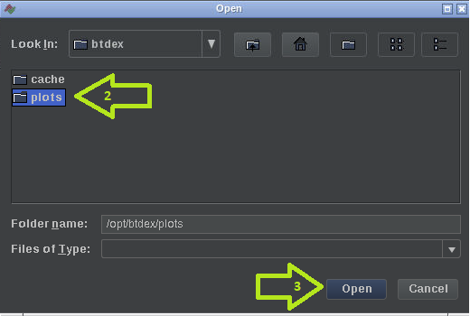

# Docker container for BTDEX (noVNC Feature) - BETA

[](https://hub.docker.com/r/furritos/docker-btdex/tags)

This is a Docker container for [BTDEX](https://btdex.trade/) based on [jlesage/docker-baseimage-gui](https://github.com/jlesage/docker-baseimage-gui) Docker image.

The GUI of the application is accessed through a modern web browser (no installation or configuration needed on the client side) or via any VNC client.

---

[](https://btdex.trade/)

BTDEX is a decentralized exchange system running on the [Signum](https://signum.network/) blockchain.

## Quick Start

**NOTE**: The Docker command provided in this quick start is given as an example and parameters 
should be adjusted to your need.

First, clone this repo and traverse into the directory:
```
git clone https://github.com/furritos/docker-btdex.git
cd docker-btdex
```

Launch the BTDEX docker container with the following Linux and PowerShell compatible command:
```
docker run -d \
  --name=container-btdex 
  -v ${pwd}/.config:/opt/btdex/.config \
  -v ${pwd}/plots:/opt/btdex/plots \
  -v ${pwd}/cache:/opt/btdex/cache \
  -p 5800:5800 \
  -p 5900:5900 \
  furritos/docker-btdex
```

Upon a successful launch, you'll receive the hash of your container.  Browse to `http://localhost:5800` 
to access the BTDEX GUI over your default web browser.  Configuration of accounts are out of scope for 
this document.  Please refer to **BTDEX's** [Get Started](https://btdex.trade/index.html#GetStarted) page for more information.  What will be covered is 
the usage of volume between BTDEX and Docker.

## BTDEX Volumes

There are three volumes being mounted here:
  - **Configuration**: `/opt/btdex/.config`
    - `config.properties` is the file BTDEX's configuration file
  - **Plot storage**: `/opt/btdex/plots` 
    - Required, volume where plotted files will be stored
  - **Plot caching**: `/opt/btdex/cache`
    - Optional, a high speed storage device (SSD) that stages plotting files
      - A cache drive is highly recommended when the **plot storage** is an SMR drive

### Configuring 

**NOTE**: Advanced Docker volume mounting is out of scope for this document.  For this example, we are 
just mounting to a local folder on the server and is **not the recommended approach**.  

**NOTE 2**: Additional BTDEX configurations are out of scope for this document.  Visit [BTDEX's Discord Channel](https://discord.com/invite/WGQBvqs)
for more information.

#### Cache Volume (optional)

  - Click on the **MINING** tab **(1)** and then click on **Select a SSD cache** button **(2)**
  
  - Select the `cache` folder and click `Open`
  

#### Plot Volume (required for plotting and mining)

  - Click on the **MINING** tab **(1)** and then click on **Select a disk folder to use** button **(2)**
  
  - Select the `plots` folder and click `Open`
  

**NOTE**: More than one folder is allowed in BTDEX but that would also require additional volumes to be 
configured on the docker container.  Additional volume configurations are outside the scope of this document 
but reference documentation is provided further below.

---

## Docker Basic Usage

```
docker run [-d] \
  --name=container-btdex \
  [-v <HOST_DIR>:<CONTAINER_DIR>[:PERMISSIONS]]... \
  [-p <HOST_PORT>:<CONTAINER_PORT>]... \
  [-e <VARIABLE_NAME>=<VALUE>]... \
  furritos/docker-btdex
```
| Parameter | Description |
|-----------|-------------|
| -d        | Run the container in the background.  If not set, the container runs in the foreground. |
| -v        | Set a volume mapping (allows to share a folder/file between the host and the container).  See the [Data Volumes](#data-volumes) section for more details. |
| -p        | Set a network port mapping (exposes an internal container port to the host).  See the [Ports](#ports) section for more details. |
| -e        | Pass an environment variable to the container. See the [Environment Variables](#environment-variables) section for more details. |

### Docker Image Environment Variables

To customize some properties of this container that is based off the `jlesage/docker-baseimage-gui` image, the following environment variables can be passed via the `-e` parameter (one for each variable).  Value of this parameter has the format `<VARIABLE_NAME>=<VALUE>`.

| Variable       | Description                                  | Default |
|----------------|----------------------------------------------|---------|
|`USER_ID`| ID of the user the application runs as.  See [User/Group IDs](#usergroup-ids) to better understand when this should be set. | `1000` |
|`GROUP_ID`| ID of the group the application runs as.  See [User/Group IDs](#usergroup-ids) to better understand when this should be set. | `1000` |
|`SUP_GROUP_IDS`| Comma-separated list of supplementary group IDs of the application. | (unset) |
|`UMASK`| Mask that controls how file permissions are set for newly created files. The value of the mask is in octal notation.  By default, this variable is not set and the default umask of `022` is used, meaning that newly created files are readable by everyone, but only writable by the owner. See the following online umask calculator: http://wintelguy.com/umask-calc.pl | (unset) |
|`TZ`| [TimeZone] of the container.  Timezone can also be set by mapping `/etc/localtime` between the host and the container. | `Etc/UTC` |
|`KEEP_APP_RUNNING`| When set to `1`, the application will be automatically restarted if it crashes or if a user quits it. | `0` |
|`APP_NICENESS`| Priority at which the application should run.  A niceness value of -20 is the highest priority and 19 is the lowest priority.  By default, niceness is not set, meaning that the default niceness of 0 is used.  **NOTE**: A negative niceness (priority increase) requires additional permissions.  In this case, the container should be run with the docker option `--cap-add=SYS_NICE`. | (unset) |
|`CLEAN_TMP_DIR`| When set to `1`, all files in the `/tmp` directory are deleted during the container startup. | `1` |
|`DISPLAY_WIDTH`| Width (in pixels) of the application's window. | `1280` |
|`DISPLAY_HEIGHT`| Height (in pixels) of the application's window. | `768` |
|`SECURE_CONNECTION`| When set to `1`, an encrypted connection is used to access the application's GUI (either via a web browser or VNC client).  See the [Security](#security) section for more details. | `0` |
|`VNC_PASSWORD`| Password needed to connect to the application's GUI.  See the [VNC Password](#vnc-password) section for more details. | (unset) |
|`X11VNC_EXTRA_OPTS`| Extra options to pass to the x11vnc server running in the Docker container.  **WARNING**: For advanced users. Do not use unless you know what you are doing. | (unset) |
|`ENABLE_CJK_FONT`| When set to `1`, open-source computer font `WenQuanYi Zen Hei` is installed.  This font contains a large range of Chinese/Japanese/Korean characters. | `0` |
|`INSTALL_EXTRA_PKGS`| Space-separated list of Alpine Linux packages to install.  See https://pkgs.alpinelinux.org/packages?name=&branch=v3.9&arch=x86_64 for the list of available Alpine Linux packages. | (unset) |

### Data Volumes

The following table describes data volumes used by the container.  The mappings
are set via the `-v` parameter.  Each mapping is specified with the following
format: `<HOST_DIR>:<CONTAINER_DIR>[:PERMISSIONS]`.

| Container path  | Permissions | Description |
|-----------------|-------------|-------------|
|`/opt/btdex/.config`| rw | This is where the application stores its configuration for persistency. |

### Ports

Here is the list of ports used by the container.  They can be mapped to the host
via the `-p` parameter (one per port mapping).  Each mapping is defined in the
following format: `<HOST_PORT>:<CONTAINER_PORT>`.  The port number inside the
container cannot be changed, but you are free to use any port on the host side.

| Port | Mapping to host | Description |
|------|-----------------|-------------|
| 5800 | Mandatory | Port used to access the application's GUI via the web interface. |
| 5900 | Optional | Port used to access the application's GUI via the VNC protocol.  Optional if no VNC client is used. |
| 9000 | Optional | Port used by *BTDEX* to expose API endpoints.  More information can be found over at [BTDEX - API](https://github.com/btdex/btdex#api) section. |

### Changing Parameters of a Running Container

As can be seen, environment variables, volume and port mappings are all specified
while creating the container.

The following steps describe the method used to add, remove or update
parameter(s) of an existing container.  The general idea is to destroy and
re-create the container:

  1. Stop the container (if it is running):
```
docker stop container-btdex 
```
  2. Remove the container:
```
docker rm container-btdex 
```
  3. Create/start the container using the `docker run` command, by adjusting
     parameters as needed.

**NOTE**: Since all application's data is saved under the `/opt/btdex/.config` container
folder, destroying and re-creating a container is not a problem: nothing is lost
and the application comes back with the same state (as long as the volume mapping of
the `/opt/btdex/.config` folder remains the same).

## Docker Image Update

Because features are added, issues are fixed, or simply because a new version
of the containerized application is integrated, the Docker image is regularly
updated.  Different methods can be used to update the Docker image.

The system used to run the container may have a built-in way to update
containers.  If so, this could be your primary way to update Docker images.

An other way is to have the image be automatically updated with [Watchtower].
Whatchtower is a container-based solution for automating Docker image updates.
This is a "set and forget" type of solution: once a new image is available,
Watchtower will seamlessly perform the necessary steps to update the container.

Finally, the Docker image can be manually updated with these steps:

  1. Fetch the latest image:
```
docker pull furritos/docker-btdex
```
  2. Stop the container:
```
docker stop container-btdex 
```
  3. Remove the container:
```
docker rm container-btdex 
```
  4. Create and start the container using the `docker run` command, with the
the same parameters that were used when it was deployed initially.

[Watchtower]: https://github.com/containrrr/watchtower

### unRAID

For unRAID, a container image can be updated by following these steps:

  1. Select the *Docker* tab.
  2. Click the *Check for Updates* button at the bottom of the page.
  3. Click the *update ready* link of the container to be updated.

## User/Group IDs

When using data volumes (`-v` flags), permissions issues can occur between the
host and the container.  For example, the user within the container may not
exist on the host.  This could prevent the host from properly accessing files
and folders on the shared volume.

To avoid any problem, you can specify the user the application should run as.

This is done by passing the user ID and group ID to the container via the
`USER_ID` and `GROUP_ID` environment variables.

To find the right IDs to use, issue the following command on the host, with the
user owning the data volume on the host:

    id <username>

Which gives an output like this one:
```
uid=1000(myuser) gid=1000(myuser) groups=1000(myuser),4(adm),24(cdrom),27(sudo),46(plugdev),113(lpadmin)
```

The value of `uid` (user ID) and `gid` (group ID) are the ones that you should
be given the container.

## Accessing the GUI

Assuming that container's ports are mapped to the same host's ports, the
graphical interface of the application can be accessed via:

  * A web browser:
```
http://<HOST IP ADDR>:5800
```

  * Any VNC client:
```
<HOST IP ADDR>:5900
```

## Security

By default, access to the application's GUI is done over an unencrypted
connection (HTTP or VNC).

Secure connection can be enabled via the `SECURE_CONNECTION` environment
variable.  See the [Environment Variables](#environment-variables) section for
more details on how to set an environment variable.

When enabled, application's GUI is performed over an HTTPs connection when
accessed with a browser.  All HTTP accesses are automatically redirected to
HTTPs.

When using a VNC client, the VNC connection is performed over SSL.  Note that
few VNC clients support this method.  [SSVNC] is one of them.

[SSVNC]: http://www.karlrunge.com/x11vnc/ssvnc.html

### Certificates

Here are the certificate files needed by the container.  By default, when they
are missing, self-signed certificates are generated and used.  All files have
PEM encoded, x509 certificates.

| Container Path                  | Purpose                    | Content |
|---------------------------------|----------------------------|---------|
|`/config/certs/vnc-server.pem`   |VNC connection encryption.  |VNC server's private key and certificate, bundled with any root and intermediate certificates.|
|`/config/certs/web-privkey.pem`  |HTTPs connection encryption.|Web server's private key.|
|`/config/certs/web-fullchain.pem`|HTTPs connection encryption.|Web server's certificate, bundled with any root and intermediate certificates.|

**NOTE**: To prevent any certificate validity warnings/errors from the browser
or VNC client, make sure to supply your own valid certificates.

**NOTE**: Certificate files are monitored and relevant daemons are automatically
restarted when changes are detected.

### VNC Password

To restrict access to your application, a password can be specified.  This can
be done via two methods:
  * By using the `VNC_PASSWORD` environment variable.
  * By creating a `.vncpass_clear` file at the root of the `/config` volume.
    This file should contain the password in clear-text.  During the container
    startup, content of the file is obfuscated and moved to `.vncpass`.

The level of security provided by the VNC password depends on two things:
  * The type of communication channel (encrypted/unencrypted).
  * How secure the access to the host is.

When using a VNC password, it is highly desirable to enable the secure
connection to prevent sending the password in clear over an unencrypted channel.

**ATTENTION**: Password is limited to 8 characters.  This limitation comes from
the Remote Framebuffer Protocol [RFC](https://tools.ietf.org/html/rfc6143) (see
section [7.2.2](https://tools.ietf.org/html/rfc6143#section-7.2.2)).  Any
characters beyond the limit are ignored.

## Shell Access

To get shell access to the running container, execute the following command:

```
docker exec -ti container-btdex sh
```

## Support or Contact

Having troubles with the container or have questions?  Please
[create a new issue].

[create a new issue]: https://github.com/furritos/docker-btdex/issues